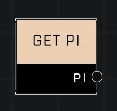

# Get Pi

## Description
Returns the constant, Pi. After all, everybody loves Pi.

## Node Type
Nodes fall into two basic categories: Data and Execution. This node supplies Data for an Execution node.

## Inputs
| Input | Type | Required | Description |
|------------------|------------------|----------|--------------------------------------------------------------|
| (None) | N/A | N/A | |

## Outputs
| Output | Type | Description |
|------------------|------------------|--------------------------------------------------------------|
| PI | Number | Outputs Pi (3.14159265359)|

\
\
**Contributors**

AddiCt3d 2CHa0s