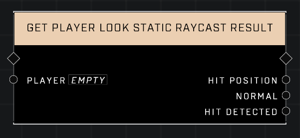

# Get Player Look Static Raycast Result

## Description
Executes a physics raycast command that collides with the static player movement environment from the look direction of a player.  

## Node Type
Nodes fall into two basic categories: Data and Execution. This node Executes a function directly in the node string.

## Inputs
| Input | Type | Required | Description |
|------------------|------------------|----------|--------------------------------------------------------------|
| Player | Player | Yes | Player to use for look to get static raycast result. |

## Outputs
| Output | Type | Description |
|------------------|------------------|--------------------------------------------------------------|
| Hit Position | Vector3 | Position, if any, where raycast collides with static object. |
| Normal | Vector3 | Normalized vector based on Hit Position. |
| Hit Detected | Boolean | TRUE if raycast has collided with a dynamic object. |

\
\
**Contributors**

AddiCt3d 2CHa0s \
Okom \
Jordan9232