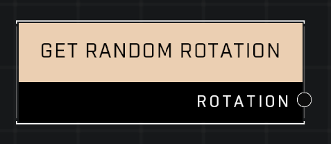

# Get Random Rotation

## Description
Returns a vector representing a random rotation.

## Node Type
Nodes fall into two basic categories: Data and Execution. This node supplies Data for an Execution node.

## Inputs
| Input | Type | Required | Description |
|------------------|------------------|----------|--------------------------------------------------------------|
| (None) | N/A | N/A | |

## Outputs
| Output | Type | Description |
|------------------|------------------|--------------------------------------------------------------|
| Rotation | Vector3 | Outputs a random rotation. |

\
\
**Contributors**

AddiCt3d 2CHa0s