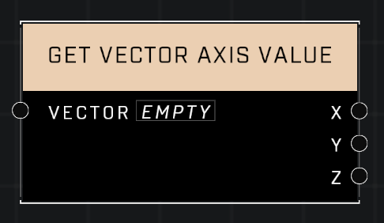

# Get Vector Axis Value

## Description
Get individual axis values from the Vector

## Node Type
Nodes fall into two basic categories: Data and Execution. This node supplies Data for an Execution node.

## Inputs
| Input | Type | Required | Description |
|------------------|------------------|----------|--------------------------------------------------------------|
| Vector | Vector3 | Yes | The Vector3 to split into axis values. |

## Outputs
| Output | Type | Description |
|------------------|------------------|--------------------------------------------------------------|
| X | Number | Outputs the X value of given Vector3. |
| Y | Number | Outputs the Y value of given Vector3. |
| Z | Number | Outputs the Z value of given Vector3. |

\
\
**Contributors**

AddiCt3d 2CHa0s