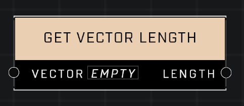

# Get Vector Length

## Description
Get the length of the Vector

## Node Type
Nodes fall into two basic categories: Data and Execution. This node supplies Data for an Execution node.

## Inputs
| Input | Type | Required | Description |
|------------------|------------------|----------|--------------------------------------------------------------|
| Vector | Vector3 | Yes | Vector3 to get length of. |

## Outputs
| Output | Type | Description |
|------------------|------------------|--------------------------------------------------------------|
| Length | Number | Outputs the length of given vector. |

\
\
**Contributors**

AddiCt3d 2CHa0s