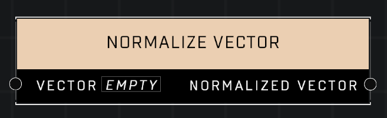

# Normalize Vector

## Description
Returns a normalized copy of the Vector

## Node Type
Nodes fall into two basic categories: Data and Execution. This node supplies Data for an Execution node.

## Inputs
| Input | Type | Required | Description |
|------------------|------------------|----------|--------------------------------------------------------------|
| Vector | Vector3 | Yes | Vector3 to normalize. |

## Outputs
| Output | Type | Description |
|------------------|------------------|--------------------------------------------------------------|
| Normalized Vector | Number | Outputs the given vector, normalized. |

\
\
**Contributors**

AddiCt3d 2CHa0s