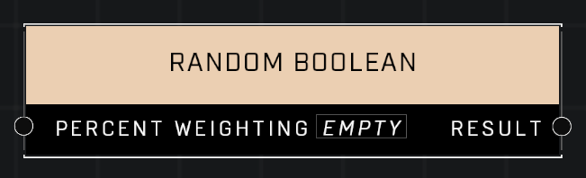

# Random Boolean

## Description
Returns a random true/false value, with the given chance to return true. For example, choose a Percent Weighting of 60 to return true 60% of the time.

## Node Type
Nodes fall into two basic categories: Data and Execution. This node supplies Data for an Execution node.

## Inputs
| Input | Type | Required | Description |
|------------------|------------------|----------|--------------------------------------------------------------|
| Percent Weighting | Number | Yes | Percentage of times boolean should output TRUE. |

## Outputs
| Output | Type | Description |
|------------------|------------------|--------------------------------------------------------------|
| Result | Boolean | The resulting random boolean. |

\
\
**Contributors**

AddiCt3d 2CHa0s