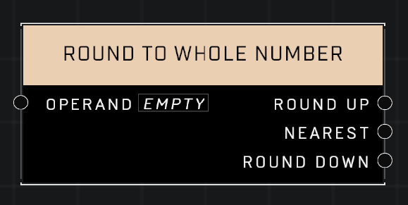

# Round To Whole Number

## Description
Returns the Operand rouded up, rounded down, and rounded to the nearest whole number

## Node Type
Nodes fall into two basic categories: Data and Execution. This node supplies Data for an Execution node.

## Inputs
| Input | Type | Required | Description |
|------------------|------------------|----------|--------------------------------------------------------------|
| Operand | Number | Yes | Operand to compare against other input. |

## Outputs
| Output | Type | Description |
|------------------|------------------|--------------------------------------------------------------|
| Round Up | Number | Rounds given number up to the nearest whole number. |
| Nearest | Number | Rounds given number up or down, depending on which is nearest. |
| Round Down | Number | Rounds given number down to the nearest whole number. |

\
\
**Contributors**

AddiCt3d 2CHa0s
