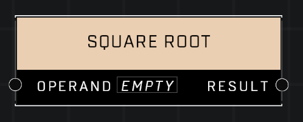

# Square Root

## Description
Returns the square root of the Operand. Negative inputs will return the square root of their absolute values.

## Node Type
Nodes fall into two basic categories: Data and Execution. This node supplies Data for an Execution node.

## Inputs
| Input | Type | Required | Description |
|------------------|------------------|----------|--------------------------------------------------------------|
| Operand | Number | Yes | Number to get the square root of. |

## Outputs
| Output | Type | Description |
|------------------|------------------|--------------------------------------------------------------|
| Result | Number | The scale root of given number. |

\
\
**Contributors**

AddiCt3d 2CHa0s