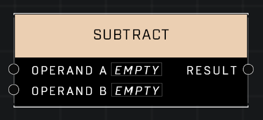

# Subtract

## Description
Returns the difference between the two input values

## Node Type
Nodes fall into two basic categories: Data and Execution. This node supplies Data for an Execution node.

## Inputs
| Input | Type | Required | Description |
|------------------|------------------|----------|--------------------------------------------------------------|
| Operand A | Number | Yes | Number to subtract other input from. |
| Operand B | Number | Yes | Number to subtract from other input. |

## Outputs
| Output | Type | Description |
|------------------|------------------|--------------------------------------------------------------|
| Result | Number | The result of Operand B subtracted from Operand A. |

\
\
**Contributors**

AddiCt3d 2CHa0s