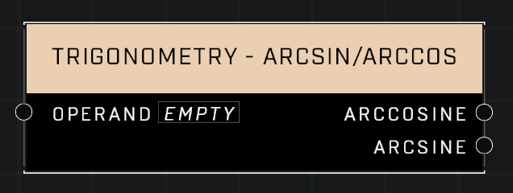

# Trigonometry - ArcSin/ArcCos

## Description
Returns the inverse sine and cosine of radians of the given value

## Node Type
Nodes fall into two basic categories: Data and Execution. This node supplies Data for an Execution node.

## Inputs
| Input | Type | Required | Description |
|------------------|------------------|----------|--------------------------------------------------------------|
| Operand | Number | Yes | The radians to get ArcCosine and ArcSine from |

## Outputs
| Output | Type | Description |
|------------------|------------------|--------------------------------------------------------------|
| ArcCosine | Number | Outputs the ArcCosine of given radians. |
| Arcsine | Number | Outputs the Arcsine of given radians. |

\
\
**Contributors**

AddiCt3d 2CHa0s