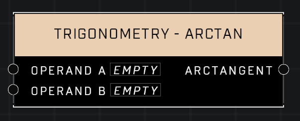

# Trigonometry - ArcTan

## Description
Returns the inverse tangent of A/B in radians, using the signs of both parameters to find the quadrant of the result. Returns 0 if both A and B are 0.

## Node Type
Nodes fall into two basic categories: Data and Execution. This node supplies Data for an Execution node.

## Inputs
| Input | Type | Required | Description |
|------------------|------------------|----------|--------------------------------------------------------------|
| Operand A | Number | Yes | Vector axis to get Arctangent from. |
| Operand B | Number | Yes | Vector axis to get Arctangent from. |

## Outputs
| Output | Type | Description |
|------------------|------------------|--------------------------------------------------------------|
| Arctangent | Number | The inverse tangent of Operand A and Operand B. |

\
\
**Contributors**

AddiCt3d 2CHa0s