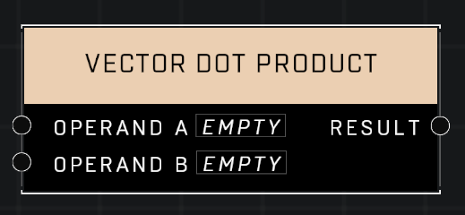

# Vector Dot Product

## Description
Calculate the dot product of two input vectors

## Node Type
Nodes fall into two basic categories: Data and Execution. This node supplies Data for an Execution node.

## Inputs
| Input | Type | Required | Description |
|------------------|------------------|----------|--------------------------------------------------------------|
| Operand A | Vector3 | Yes | A position to calculate dot product from. |
| Operand B | Vector3 | Yes | A position to calculate dot product from. |

## Outputs
| Output | Type | Description |
|------------------|------------------|--------------------------------------------------------------|
| Result | Vector3 | The Vector3 that is the dot product of both inputs. |

\
\
**Contributors**

AddiCt3d 2CHa0s