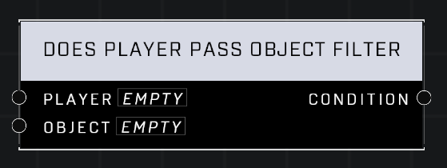

# Does Player Pass Object Filter

## Description
Nodes that apply filters to restrict useage of interactable objects

## Node Type
Nodes fall into two basic categories: Data and Execution. This node supplies Data for an Execution node.

## Inputs
| Input | Type | Required | Description |
|------------------|------------------|----------|--------------------------------------------------------------|
| Player | Player | Yes | Player to check filter for. |
| Object | Object | Yes | Object to check filter on. |

## Outputs
| Output | Type | Description |
|------------------|------------------|--------------------------------------------------------------|
| Condition | Boolean | TRUE if player passes filter, FALSE if not. |

\
\
**Contributors**

AddiCt3d 2CHa0s

