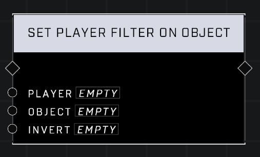

# Set Player Filter On Object

## Description
Adds a filter to the Object that only allows the specified Player to interact with the object. If Inverted, the object cannot be interacted with by the Player; filters must be reapplied to objects that are respawned.

## Node Type
Nodes fall into two basic categories: Data and Execution. This node Executes a function directly in the node string.

## Inputs
| Input | Type | Required | Description |
|------------------|------------------|----------|--------------------------------------------------------------|
| Player | Player | Yes | Player to set filter for. |
| Object | Object | Yes | Object to set filter on for player. |
| Invert | Boolean | Yes | If TRUE, player cannot access object. If FALSE, player can access object. |

## Outputs
| Output | Type | Description |
|------------------|------------------|--------------------------------------------------------------|
| (none) | | |

\
\
**Contributors**

AddiCt3d 2CHa0s