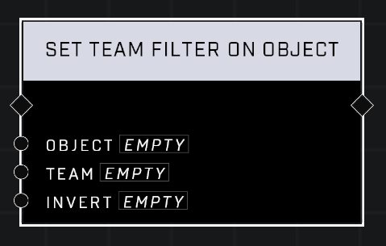

# Set Team Filter On Object

## Description
Adds a filter to the Object that only allows the specified Team to interact with the object. If Inverted, the object cannot be interacted with by this Team; filters must be reapplied to objects that are respawned.

## Node Type
Nodes fall into two basic categories: Data and Execution. This node Executes a function directly in the node string.

## Inputs
| Input | Type | Required | Description |
|------------------|------------------|----------|--------------------------------------------------------------|
| Object | Object | Yes | Object to set filter on for team. |
| Team | Team | Yes | Team to set filter for. |
| Invert | Boolean | Yes | If TRUE, team cannot access object. If FALSE, team can access object. |

## Outputs
| Output | Type | Description |
|------------------|------------------|--------------------------------------------------------------|
| (none) | | |

\
\
**Contributors**

AddiCt3d 2CHa0s