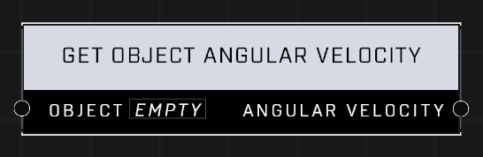

# Get Object Angular Velocity

## Description
Returns the angular velocity of the Object

## Node Type
Nodes fall into two basic categories: Data and Execution. This node supplies Data for an Execution node.

## Inputs
| Input | Type | Required | Description |
|------------------|------------------|----------|--------------------------------------------------------------|
| Object | Object | Yes | Object to get angular velocity of. |

## Outputs
| Output | Type | Description |
|------------------|------------------|--------------------------------------------------------------|
| Angular Velocity | Vector3 | Current angular velocity of given object. |

\
\
**Contributors**

AddiCt3d 2CHa0s