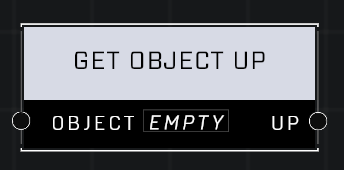

# Get Object Up

## Description
Gets the vector facing upwards from the Object's relative rotation

## Node Type
Nodes fall into two basic categories: Data and Execution. This node supplies Data for an Execution node.

## Inputs
| Input | Type | Required | Description |
|------------------|------------------|----------|--------------------------------------------------------------|
| Object | Object | Yes | Object to get up of. |

## Outputs
| Output | Type | Description |
|------------------|------------------|--------------------------------------------------------------|
| Up | Vector3 | Current up of given object. |

\
\
**Contributors**

AddiCt3d 2CHa0s