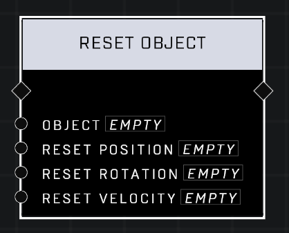

# Reset Object

## Description
Resets the position, rotation, and/or velocity of the Object

## Node Type
Nodes fall into two basic categories: Data and Execution. This node supplies Data for an Execution node.

## Inputs
| Input | Type | Required | Description |
|------------------|------------------|----------|--------------------------------------------------------------|
| Object | Object | Yes | Object to check filter on. |
| Reset Position | Boolean | Yes | If TRUE, object will return to what it was on spawn. |
| Reset Rotation | Boolean | Yes | If TRUE, object will return to what it was on spawn. |
| Reset Velocity | Boolean | Yes | If TRUE, object will return to what it was on spawn. |

## Outputs
| Output | Type | Description |
|------------------|------------------|--------------------------------------------------------------|
| (none) | | |

\
\
**Contributors**

AddiCt3d 2CHa0s
