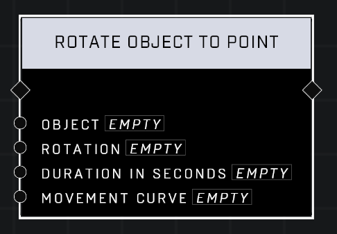

# Rotate Object To Point

## Description
Rotates the Object to the desired Rotation over the Duration in Seconds. Optionally provide a Movement Curve to make the animation non-linear. Use Move Object To Transform if moving something in sequence.

## Node Type
Nodes fall into two basic categories: Data and Execution. This node Executes a function directly in the node string.

## Inputs
| Input | Type | Required | Description |
|------------------|------------------|----------|--------------------------------------------------------------|
| Object | Object | Yes | Object to rotate. |
| Rotation | Vector3 | Yes | Rotation to move object to. |
| Duration In Seconds | Number | Yes | How many seconds to take for the rotate animation. |
| Movement Curve | Movement Curve | Yes | What type of curve to use for the rotation start and stop animation speed. |

## Outputs
| Output | Type | Description |
|------------------|------------------|--------------------------------------------------------------|
| (none) | | |

\
\
**Contributors**

AddiCt3d 2CHa0s