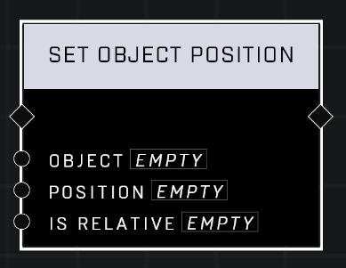

# Set Object Position

## Description
Sets the position of the Object

## Node Type
Nodes fall into two basic categories: Data and Execution. This node supplies Data for an Execution node.

## Inputs
| Input | Type | Required | Description |
|------------------|------------------|----------|--------------------------------------------------------------|
| Object | Object | Yes | Object to set position of. |
| Position | Vector3 | Yes | Position to set object at. |
| Is Relative | Boolean | Yes | If TRUE, object will set local instead of world. |

## Outputs
| Output | Type | Description |
|------------------|------------------|--------------------------------------------------------------|
| (none) | | |

\
\
**Contributors**

AddiCt3d 2CHa0s