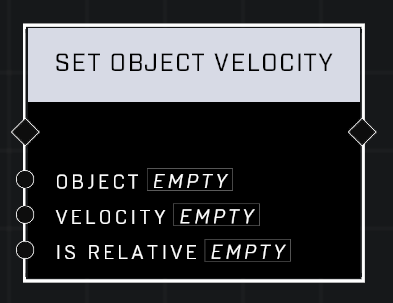

# Set Object Velocity

## Description
Sets the world space velocity of the Object

## Node Type
Nodes fall into two basic categories: Data and Execution. This node supplies Data for an Execution node.

## Inputs
| Input | Type | Required | Description |
|------------------|------------------|----------|--------------------------------------------------------------|
| Object | Object | Yes | Object to set velocity for. |
| Velocity | Vector3 | Yes | Velocity to set for object. |
| Is Relative | Boolean | Yes | If TRUE, local vector is used instead of world. |

## Outputs
| Output | Type | Description |
|------------------|------------------|--------------------------------------------------------------|
| (none) | | |

\
\
**Contributors**

AddiCt3d 2CHa0s