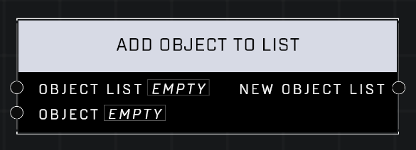

# Add Object To List

## Description
Return a new list with all the objects in the Object List, plus the Object.

## Node Type
Nodes fall into two basic categories: Data and Execution. This node supplies Data for an Execution node.

## Inputs
| Input | Type | Required | Description |
|------------------|------------------|----------|--------------------------------------------------------------|
| Object List | Object List | Yes | Object list that object will be added to. |
| Object | Object | Yes | Object to add to the list. |

## Outputs
| Output | Type | Description |
|------------------|------------------|--------------------------------------------------------------|
| New Object List | Object List | Outputs the new list with the object added. |

\
\
**Contributors**

AddiCt3d 2CHa0s