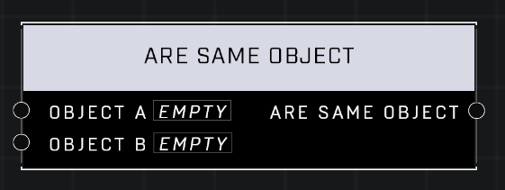

# Are Same Object

## Description
Nodes that interact with objects and object lists

## Node Type
Nodes fall into two basic categories: Data and Execution. This node supplies Data for an Execution node.

## Inputs
| Input | Type | Required | Description |
|------------------|------------------|----------|--------------------------------------------------------------|
| Object | Object | Yes | Object to check if it's the same as other object. |
| Object | Object | Yes | Object to check if it's the same as other object. |

## Outputs
| Output | Type | Description |
|------------------|------------------|--------------------------------------------------------------|
| Are Same Object | Boolean | Outputs TRUE if both objects are the same object, otherwise is FALSE. |

\
\
**Contributors**

AddiCt3d 2CHa0s