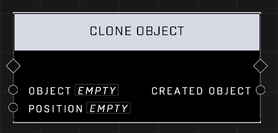

# Clone Object

## Description
Clones the specified Object, creating a new instance at the Position. CAUTION: This will blow up the budget if used liberally.

## Node Type
Nodes fall into two basic categories: Data and Execution. This node Executes a function directly in the node string.

## Inputs
| Input | Type | Required | Description |
|------------------|------------------|----------|--------------------------------------------------------------|
| Object | Object | Yes | Object to clone. |
| Position | Vector3 | Yes | Position where Object's clone will spawn. |

## Outputs
| Output | Type | Description |
|------------------|------------------|--------------------------------------------------------------|
| Created Object | Object | The cloned object. |

\
\
**Contributors**

AddiCt3d 2CHa0s