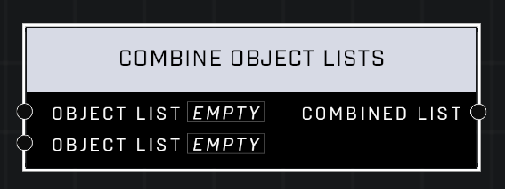

# Combine Object Lists

## Description
Create a list with all objects in either Object List

## Node Type
Nodes fall into two basic categories: Data and Execution. This node supplies Data for an Execution node.

## Inputs
| Input | Type | Required | Description |
|------------------|------------------|----------|--------------------------------------------------------------|
| Object List | Object List | Yes | An object list to combine into a new list. |
| Object List | Object List | Yes | An object list to combine into a new list. |
| Combine To First List | Boolean | Yes | Whether or not to automatically update the first Object List variable by adding the items to it from the second list. |

## Outputs
| Output | Type | Description |
|------------------|------------------|--------------------------------------------------------------|
| Combined List | Object List | A new list of the two lists combined. |

\
\
**Contributors**

AddiCt3d 2CHa0s \
Okom