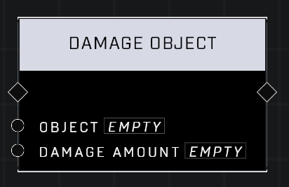

# Damage Object

## Description
Deals the Damage Amount as raw damage to the Object. Final damage dealt value is affected by the material of the Object. Use Get Object Health and Print Number to Killfeed to determine final value if needed.

## Node Type
Nodes fall into two basic categories: Data and Execution. This node Executes a function directly in the node string.

## Inputs
| Input | Type | Required | Description |
|------------------|------------------|----------|--------------------------------------------------------------|
| Object| Object | Yes | Object that is to take damage. |
| Damage Amount | Number | Yes | How much damage to apply to Object. |

## Outputs
| Output | Type | Description |
|------------------|------------------|--------------------------------------------------------------|
| (none) |  |  |

\
\
**Contributors**

AddiCt3d 2CHa0s