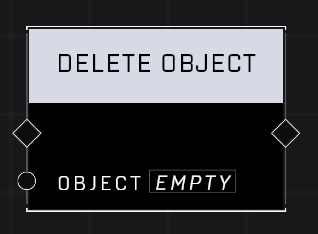

# Delete Object

## Description
Despawns the Object if it is currently spawned

## Node Type
Nodes fall into two basic categories: Data and Execution. This node Executes a function directly in the node string.

## Inputs
| Input | Type | Required | Description |
|------------------|------------------|----------|--------------------------------------------------------------|
| Object | Object | Yes | Object that is to be deleted. |

## Outputs
| Output | Type | Description |
|------------------|------------------|--------------------------------------------------------------|
 (none) |  |  |

\
\
**Contributors**

AddiCt3d 2CHa0s