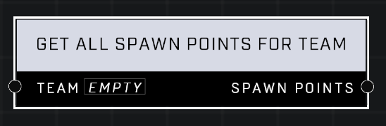

# Get All Spawn Points For Team

## Description
Get a list of all spawn points (128, maximum) that are set to a specific Team. Excludes initial spawn points and backup spawn points.

## Node Type
Nodes fall into two basic categories: Data and Execution. This node supplies Data for an Execution node.

## Inputs
| Input | Type | Required | Description |
|------------------|------------------|----------|--------------------------------------------------------------|
| Team | Team | Yes | Only spawn points set to this team will be added to the output list. |

## Outputs
| Output | Type | Description |
|------------------|------------------|--------------------------------------------------------------|
| Spawn Points | Object List | Object List containing all spawn points of given team. |

\
\
**Contributors**

AddiCt3d 2CHa0s