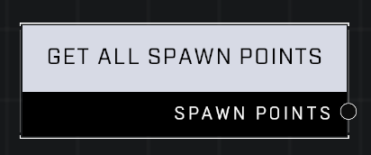

# Get All Spawn Points

## Description
Get a list of all spawn points (128, maximum) on the map. Excludes initial spawn points and backup spawn points.

## Node Type
Nodes fall into two basic categories: Data and Execution. This node supplies Data for an Execution node.

## Inputs
| Input | Type | Required | Description |
|------------------|------------------|----------|--------------------------------------------------------------|
| (none) |  |  |  |

## Outputs
| Output | Type | Description |
|------------------|------------------|--------------------------------------------------------------|
| Spawn Points | Object List | A list of all valid Spawn Point objects in the game. |

\
\
**Contributors**

AddiCt3d 2CHa0s