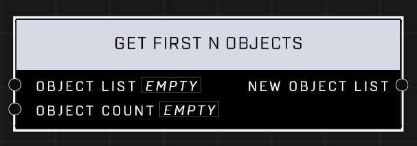

# Get First N Objects

## Description
Gets the first N objects from the Object List

## Node Type
Nodes fall into two basic categories: Data and Execution. This node supplies Data for an Execution node.

## Inputs
| Input | Type | Required | Description |
|------------------|------------------|----------|--------------------------------------------------------------|
| Object List | Object List | Yes | Object list that objects will be pulled from. |
| Object Count | Number | Yes | How many objects to pull from the list. |

## Outputs
| Output | Type | Description |
|------------------|------------------|--------------------------------------------------------------|
| New Object List | Object List | A new object list containing the objects. |

\
\
**Contributors**

AddiCt3d 2CHa0s