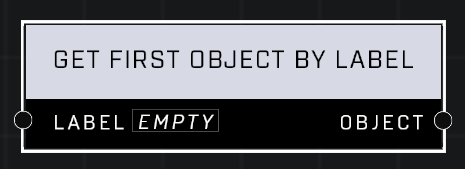

# Get First Object By Label

## Description
Returns the first object with the matching Label in their Object Properties

## Node Type
Nodes fall into two basic categories: Data and Execution. This node supplies Data for an Execution node.

## Inputs
| Input | Type | Required | Description |
|------------------|------------------|----------|--------------------------------------------------------------|
| Label | User Label | Yes | Which label to find an object of. |

## Outputs
| Output | Type | Description |
|------------------|------------------|--------------------------------------------------------------|
| Object | Object | First object found with the given label. |

\
\
**Contributors**

AddiCt3d 2CHa0s