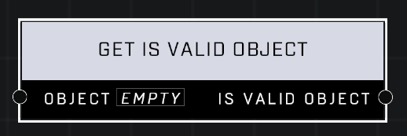

# Get Is Valid Object

## Description
Returns true if the Object is valid. Returns false if it is invalid (nil).

## Node Type
Nodes fall into two basic categories: Data and Execution. This node supplies Data for an Execution node.

## Inputs
| Input | Type | Required | Description |
|------------------|------------------|----------|--------------------------------------------------------------|
| Object | Object | Yes | Object to check if is valid. |

## Outputs
| Output | Type | Description |
|------------------|------------------|--------------------------------------------------------------|
| Is Valid Object | Boolean | Outputs TRUE if object is spawned on map, otherwise is FALSE. |

\
\
**Contributors**

AddiCt3d 2CHa0s