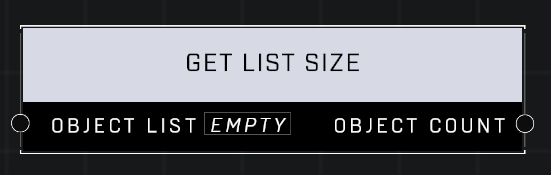

# Get List Size

## Description
Get the number of objects contained in the Object List

## Inputs
| Input | Type | Required | Description |
|------------------|------------------|----------|--------------------------------------------------------------|
| Object List | Object List | Yes | Object list to get size of. |

## Outputs
| Output | Type | Description |
|------------------|------------------|--------------------------------------------------------------|
| Object Count | Number | How many objects are in the list. |

\
\
**Contributors**

AddiCt3d 2CHa0s