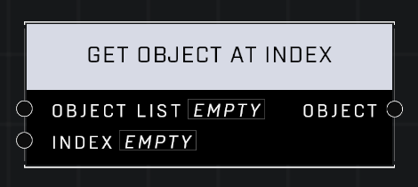

# Get Object At Index

## Description
Get the object stored at the Index of the Object List. Returns an invalid object if the index is out of bounds. Object List indices start at 1.

## Node Type
Nodes fall into two basic categories: Data and Execution. This node supplies Data for an Execution node.

## Inputs
| Input | Type | Required | Description |
|------------------|------------------|----------|--------------------------------------------------------------|
| Object List | Object List | Yes | Object list that object will be pulled from. |
| Index | Number | Yes | Index to pull object from. |

## Outputs
| Output | Type | Description |
|------------------|------------------|--------------------------------------------------------------|
| Object | Object | Object found at given index, or nil if object doesn't exist. |

\
\
**Contributors**

AddiCt3d 2CHa0s