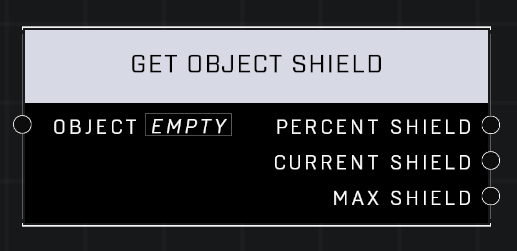

# Get Object Shield

## Description
Gets the current shield value (percentage) of the Object

## Node Type
Nodes fall into two basic categories: Data and Execution. This node supplies Data for an Execution node.

## Inputs
| Input | Type | Required | Description |
|------------------|------------------|----------|--------------------------------------------------------------|
| Object | Object | Yes | Object to get shields of. |

## Outputs
| Output | Type | Description |
|------------------|------------------|--------------------------------------------------------------|
| Percent Shield | Number | What percent of entire health object currently has. |
| Current Shield | Number | How much health object currently has. |
| Max Shield | Number | Maximum health object can have. |

\
\
**Contributors**

AddiCt3d 2CHa0s