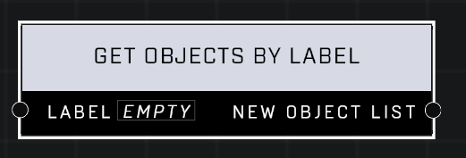

# Get Objects By Label

## Description
Returns a list of dynamic objects from the scene with a matching Label in their Object Properties. Will not return objects that cannot be referenced by node graph.

## Node Type
Nodes fall into two basic categories: Data and Execution. This node supplies Data for an Execution node.

## Inputs
| Input | Type | Required | Description |
|------------------|------------------|----------|--------------------------------------------------------------|
| Label | Label | Yes | Label to get objects for. |

## Outputs
| Output | Type | Description |
|------------------|------------------|--------------------------------------------------------------|
| New Object List | Object List | List of all valid objects with the label. |

\
\
**Contributors**

AddiCt3d 2CHa0s