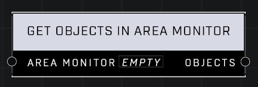

# Get Objects In Area Monitor

## Description
Creates an object list that contains all of the objects currently within the Area Monitor's boundary

## Node Type
Nodes fall into two basic categories: Data and Execution. This node supplies Data for an Execution node.

## Inputs
| Input | Type | Required | Description |
|------------------|------------------|----------|--------------------------------------------------------------|
| Area Monitor | Area Monitor | Yes | The area monitor to get objects from it's boundary. |

## Outputs
| Output | Type | Description |
|------------------|------------------|--------------------------------------------------------------|
| Objects | Object List | A list of all valid objects in the area monitor's boundary. |

\
\
**Contributors**

AddiCt3d 2CHa0s