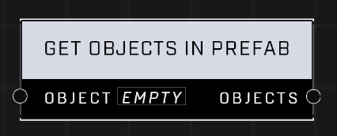

# Get Objects In Prefab

## Description
Creates an object list that contains all of the objects in the prefab that the Object is part of

## Node Type
Nodes fall into two basic categories: Data and Execution. This node supplies Data for an Execution node.

## Inputs
| Input | Type | Required | Description |
|------------------|------------------|----------|--------------------------------------------------------------|
| Object | Object | Yes | An object in the prefab. |

## Outputs
| Output | Type | Description |
|------------------|------------------|--------------------------------------------------------------|
| Objects | Object List | A list of all objects in the given object's prefab. |

\
\
**Contributors**

AddiCt3d 2CHa0s