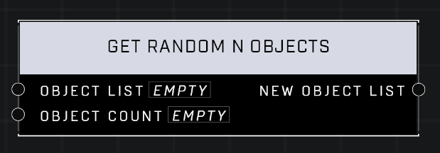

# Get Random N Objects

## Description
Gets N objects from the Object List at random

## Node Type
Nodes fall into two basic categories: Data and Execution. This node supplies Data for an Execution node.

## Inputs
| Input | Type | Required | Description |
|------------------|------------------|----------|--------------------------------------------------------------|
| Object List | Object List | Yes | Object list that objects will be pulled from. |
| Object Count | Number | Yes | How many objects to pull from the list. |

## Outputs
| Output | Type | Description |
|------------------|------------------|--------------------------------------------------------------|
| New Object List | Object List | A new list of the random objects pulled out of the given object list. |

***
## Learn More About Get Random N Objects Node
### Function

Takes an input list and provides N objects from it, selected randomly and in a random order.

### Caveats

This node will only return up to X-1 objects, where X is the size of the input list. \
\
This is especially prevalent when the list being pulled from has a dynamic size and could potentially only have a single object in it, or if Get Random N Objects is being used to randomize the order of a list.\
\
To get around this issue, the solution is to take the input list and combine it with the output of the Get Random N Objects node. This will take the missing object and add it to the end of the list.

\
\
**Contributors**\
Captain Punch\
VidGamesPete\
AddiCt3d 2CHa0s

