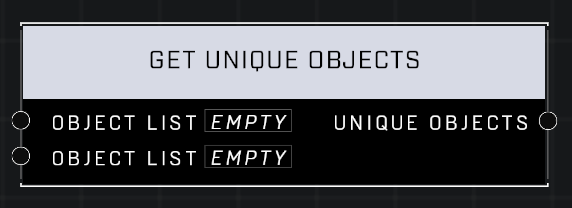

# Get Unique Objects

## Description
Create a list with all objects that are included in only one of the Object Lists

## Node Type
Nodes fall into two basic categories: Data and Execution. This node supplies Data for an Execution node.

## Inputs
| Input | Type | Required | Description |
|------------------|------------------|----------|--------------------------------------------------------------|
| Object List | Object List | Yes | Object list to check against other list if any objects are unique. |
| Object List | Object List | Yes | Object list to check against other list if any objects are unique. |

## Outputs
| Output | Type | Description |
|------------------|------------------|--------------------------------------------------------------|
| Unique Objects | Object List | A new list containing any objects that are found in only one of the lists. |

\
\
**Contributors**

AddiCt3d 2CHa0s