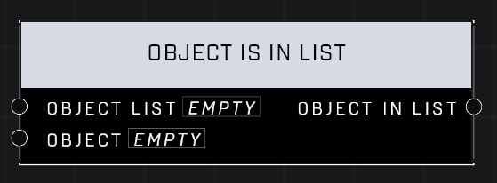

# Object Is In List

## Description
Returns whether the Object List includes the Object

## Node Type
Nodes fall into two basic categories: Data and Execution. This node supplies Data for an Execution node.

## Inputs
| Input | Type | Required | Description |
|------------------|------------------|----------|--------------------------------------------------------------|
| Object List | Object List | Yes | Object list to check if object is in it. |
| Object | Object| Yes | Object to check if it is in the list. |

## Outputs
| Output | Type | Description |
|------------------|------------------|--------------------------------------------------------------|
| Object In List | Boolean | Outputs TRUE if object is in the list, otherwise outputs false. |

\
\
**Contributors**

AddiCt3d 2CHa0s