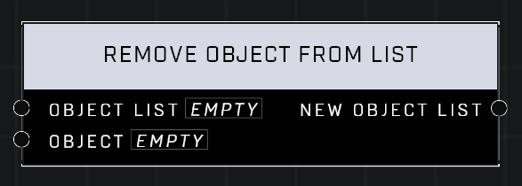

# Remove Object From List

## Description
Return a new list with all the objects in the Object List minus the Object

## Node Type
Nodes fall into two basic categories: Data and Execution. This node supplies Data for an Execution node.

## Inputs
| Input | Type | Required | Description |
|------------------|------------------|----------|--------------------------------------------------------------|
| Object List | Object List | Yes | Object list to remove object from. |
| Object | Object| Yes | Object to remove from the list. |

## Outputs
| Output | Type | Description |
|------------------|------------------|--------------------------------------------------------------|
| New Object List | Object List | A new list with the object removed. |

\
\
**Contributors**

AddiCt3d 2CHa0s