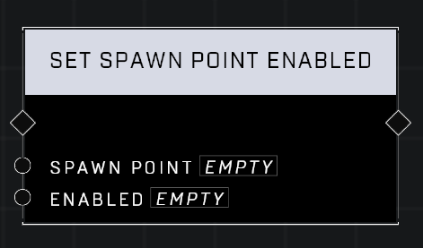

# Set Spawn Point Enabled

## Description
Enables or disables a Spawn Point. Spawn points are enabled by default. Players will be unable to spawn at disabled points after they die.

## Node Type
Nodes fall into two basic categories: Data and Execution. This node Executes a function directly in the node string.

## Inputs
| Input | Type | Required | Description |
|------------------|------------------|----------|--------------------------------------------------------------|
| Spawn Point | Spawn Point | Yes | Which spawn point object to enable or disable. |
| Enabled | Boolean | Yes | Set to TRUE to enable, FALSE to disable spawn point. |

## Outputs
| Output | Type | Description |
|------------------|------------------|--------------------------------------------------------------|
| (none) | | |

\
\
**Contributors**

AddiCt3d 2CHa0s