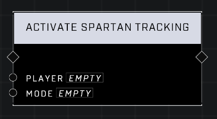

# Activate Spartan Tracking

## Description
Activate Spartan tracking for the specified Player or all players if none is specified.

## Node Type
Nodes fall into two basic categories: Data and Execution. This node Executes a function directly in the node string.

## Inputs
| Input | Type | Required | Description |
|------------------|------------------|----------|--------------------------------------------------------------|
| Player | Player | No | Which mode of Spartan Tracking: Normal or Resuppply. |
| Mode | Mode | Yes | Which mode of Spartan Tracking to activate. |

## Outputs
| Output | Type | Description |
|------------------|------------------|--------------------------------------------------------------|
| (none) | | |

\
\
**Contributors**

AddiCt3d 2CHa0s