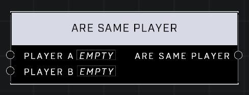

# Are Same Player

## Description
Returns true if the two objects are the same player, or if they are both invalid players.

## Node Type
Nodes fall into two basic categories: Data and Execution. This node supplies Data for an Execution node.

## Inputs
| Input | Type | Required | Description |
|------------------|------------------|----------|--------------------------------------------------------------|
| Player A | Player | Yes | A player to compare to other player. |
| Player B | Player | Yes | A player to compare to other player. |

## Outputs
| Output | Type | Description |
|------------------|------------------|--------------------------------------------------------------|
| Are Same Player | Boolean | TRUE if both inputs are the same player, otherwise FALSE. |

\
\
**Contributors**

AddiCt3d 2CHa0s