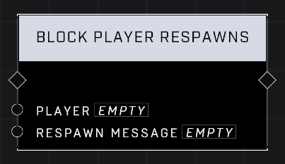

# Block Player Spawns

## Description
Prevents the Player from respawning and displays the Respawn Message until Unblock Player Respawn is called on the player. The player's respawn timer continues to count down even while blocked.

## Node Type
Nodes fall into two basic categories: Data and Execution. This node Executes a function directly in the node string.

## Inputs
| Input | Type | Required | Description |
|------------------|------------------|----------|--------------------------------------------------------------|
| Player | Player | Yes | Which player to block respawns for. |
| Respawn Message | Respawn Message | Yes | Message that displays for player when dead and respawns are blocked. (Challenge Failed, Game Over, Out of Lives, Respawning Disabled, You Died) |

## Outputs
| Output | Type | Description |
|------------------|------------------|--------------------------------------------------------------|
| (none) | | |

\
\
**Contributors**

AddiCt3d 2CHa0s