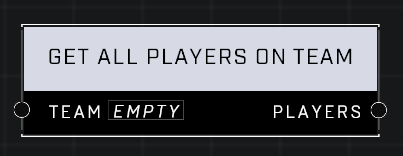

# Get All Players On Team

## Description
Return all players assigned to the Team, including players who are bots.

## Node Type
Nodes fall into two basic categories: Data and Execution. This node supplies Data for an Execution node.

## Inputs
| Input | Type | Required | Description |
|------------------|------------------|----------|--------------------------------------------------------------|
| Team | Team | Yes | Team to get player list from. |

## Outputs
| Output | Type | Description |
|------------------|------------------|--------------------------------------------------------------|
| Players | Object List | List of all players on given team. |

\
\
**Contributors**

AddiCt3d 2CHa0s