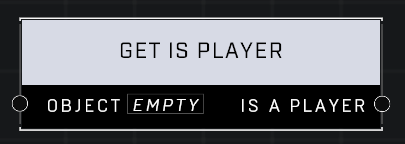

# Get Is Player

## Description
Returns true if the Object is a player

## Node Type
Nodes fall into two basic categories: Data and Execution. This node supplies Data for an Execution node.

## Inputs
| Input | Type | Required | Description |
|------------------|------------------|----------|--------------------------------------------------------------|
| Object | Object | Yes | Object to check if it's a player. |

## Outputs
| Output | Type | Description |
|------------------|------------------|--------------------------------------------------------------|
| Is A Player | Boolean | TRUE if object is a player, FALSE if not. |

\
\
**Contributors**

AddiCt3d 2CHa0s