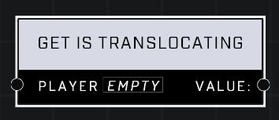

# Get Is Translocating

## Description
Determines if a player has an active Quantum Translocator

## Node Type
Nodes fall into two basic categories: Data and Execution. This node supplies Data for an Execution node.

## Inputs
| Input | Type | Required | Description |
|------------------|------------------|----------|--------------------------------------------------------------|
| Player | Player | Yes | Which player to check state of. |

## Outputs
| Output | Type | Description |
|------------------|------------------|--------------------------------------------------------------|
| Value: | Boolean | TRUE if player is in state, FALSE if not. |

\
\
**Contributors**

AddiCt3d 2CHa0s